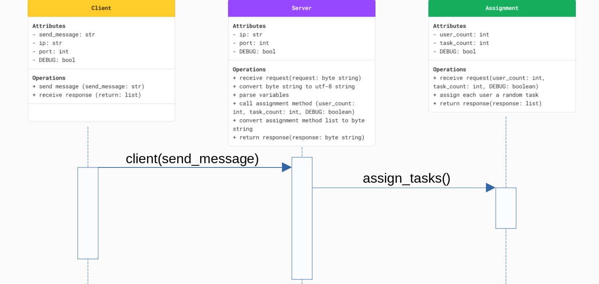

# cs-361

- cli client for the cs-361 class
- implements microservices
- uses zeromq to communicate between the microservices

## setup instructions

- `python3 -m venv venv`
- `source venv/bin/activate` (platform dependent)
- `python3 -m pip install -r requirements.txt`
- (optional) add your free meteo blue token to a .env file using the variable name "meteo_blue_token"
- (optional) add your free trial Windy token to a .env file using the variable name "nam_token"

## useage instructions

- run each file in a terminal as a microservice
- defaults should work for all servers
- run all microservices with the ui last
- like:
  - terminal 1: `python3 openmeteo_icon_query.py`
  - terminal 2: `python3 meteo_blue_query.py`
  - terminal 3: `get_quote.py`
  - terminal 4: `task_parser.py`
  - terminal 5: `ui.py`

## Communication Contract

### Clear instructions for how to programmatically REQUEST data from the microservice you implemented. Include an example call

- To request data from this microservice:
    1) Confirm sure you have followed the install instructions above
    2) Run the microservice locally `python3 task_parser.py` in a terminal or import the `server` method from task_parser and run it
    3) Use the client method to commmunicate with the server (in a separate terminal)
        - start the python interpreter `python3`
        - create variable `msg=<your team count>,<your task count>`
        - `from task_parser import client`
        - `client(send_message=msg)`
    4) You can pass an optional parameter `DEBUG=True` to the microservice and/or the client if you need to troubleshoot issues
- Example: `client(send_message='4,12', DEBUG=True)

### Clear instructions for how to programmatically RECEIVE data from the microservice you implemented

- assuming the above directions have been followed, the client method will display the response in that terminal
- the data returned will be a string / you can set the original client call equal to a variable in order to store this value
- Example: '2,11,7,4'

### UML sequence diagram showing how requesting and receiving data works

## microservice list

- CLI user interface
- ICON weather forecast
- MBLUE weather forecast
- NAM weather forecast
- Person/task assignment generator
- Inspirational quote (client only)
